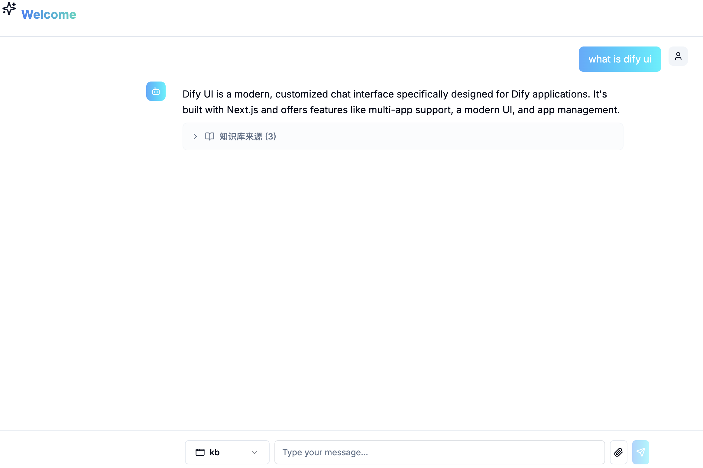
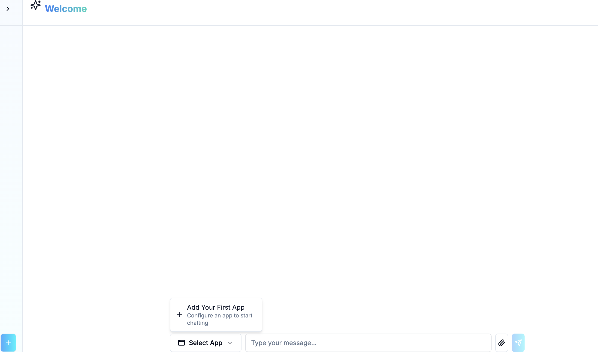
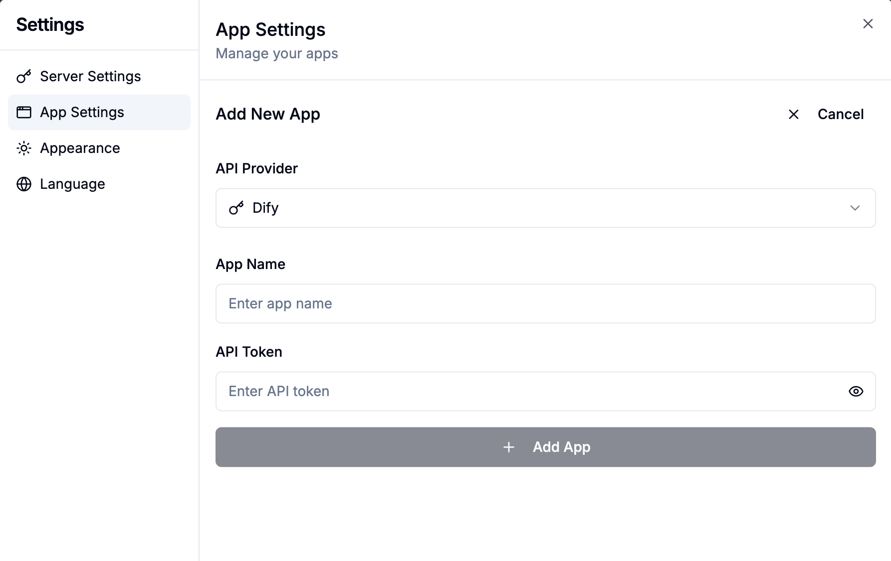

# Dify UI - Custom Chat Interface for Dify

A modern, customized chat interface specifically designed for Dify applications. Built with Next.js, this UI provides an enhanced user experience for interacting with your Dify AI applications with advanced features like knowledge retrieval, streaming responses, and multi-app management.



## ✨ Features

- 🎯 **Dify-Focused**: Specifically designed and optimized for Dify applications
- 🔄 **Multi-App Support**: Manage and switch between multiple Dify applications seamlessly
- 🎨 **Modern UI**: Beautiful, responsive interface built with Tailwind CSS and Radix UI
- 🔧 **App Management**: Easy configuration and management of multiple Dify applications

## 🚀 Quick Start

### Prerequisites

- Node.js 18+ 
- yarn

### Installation

1. **Clone the repository**
   ```bash
   git clone <repo-url>
   ```

2. **Install dependencies**
   ```bash
   yarn install
   ```

3. **Start the development server**
   ```bash
   yarn dev
   ```
   Open [http://localhost:3000](http://localhost:3000) in your browser.

## 📖 Usage

### Basic Chat
1. Open the application
2. Select a Dify application from the dropdown (if multiple apps are configured)
3. Type your message and press Enter or click Send
4. Enjoy real-time streaming responses from your Dify application!



### App Management
- Click the settings icon to manage your Dify applications
- Add new Dify applications with their API tokens
- Switch between different Dify apps using the dropdown selector
- Each app uses its own API token for secure, isolated conversations


## 🛠 Development

### Project Structure
```
├── app/                    # Next.js app directory
│   ├── api/               # API routes
│   ├── chat.tsx           # Main chat interface
│   └── layout.tsx         # Root layout
├── components/            # React components
│   ├── ui/               # Reusable UI components
│   ├── chat-history.tsx  # Chat message components
│   ├── settings-dialog.tsx # Settings management
│   └── ...
├── contexts/             # React contexts
├── hooks/               # Custom React hooks
├── lib/                # Utility functions
├── tests/              # Test files
└── types/              # TypeScript type definitions
```

## 🤝 Contributing

We welcome contributions! Please see [CONTRIBUTING.md](CONTRIBUTING.md) for guidelines.


## 📄 License

This project is licensed under the MIT License - see the [LICENSE](LICENSE) file for details.

## 📞 Support

If you have any questions or need help:
- Open an issue on GitHub
- Check the [documentation](docs/)
- Join our community discussions

---

Made with ❤️ by the community
